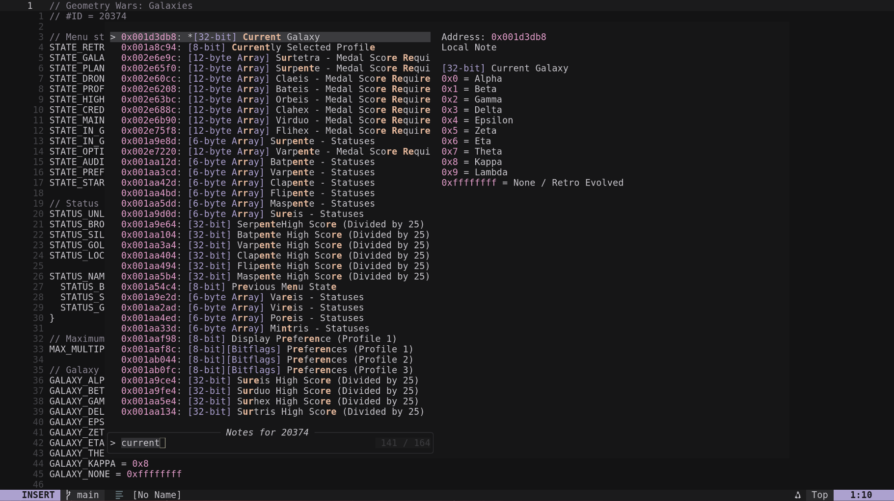

# 🍓 razz.nvim

A Neovim plugin for managing [RetroAchievements](https://retroachievements.org) code notes.



## Features

- Browse local and server code notes
- Publish local notes to the RetroAchievements server
- Telescope picker integration

## Prerequisites

- Neovim 0.10+
- [telescope.nvim](https://github.com/nvim-telescope/telescope.nvim)

## Installation (lazy.nvim)

```lua
{
  "zeapoz/razz.nvim",
  opts = {
    emulator_dirs = { "/path/to/emulator_dir" },
  },
}
```

`emulator_dirs` should point to your emulator directories. The plugin reads note data from `emulator_dir/RACache/Data/`.

## Example Configuration

```lua
{
  "zeapoz/razz.nvim",
  opts = {
    emulator_dirs = { "/path/to/emulator_dir" },
  },
  config = function(_, opts)
    local razz = require("razz")
    razz.setup(opts)
    razz.login() -- Required to push notes to the server
  end,
  keys = function()
    local notes = require("razz.notes")
    return {
      { "<leader>co", function() notes.open() end, desc = "Open code note" },
      { "<leader>cl", function() notes.open_local() end, desc = "Open local note" },
      { "<leader>cs", function() notes.open_server() end, desc = "Open server note" },
      { "<leader>cf", function() notes.fetch_server() end, desc = "Fetch server notes" },
      { "<leader>cn", function() notes.open_new() end, desc = "Open new note" },
      { "<leader>ca", function() notes.publish_all() end, desc = "Publish all local notes" },
    }
  end,
}
```

## Configuration

| Option | Type | Default | Description |
|--------|------|---------|-------------|
| `emulator_dirs` | table | `{}` | Required. List of paths to emulator directories (containing `RACache/Data/`) |
| `rascript_cli_bin` | string | `"rascript-cli"` | Path to the rascript-cli binary for managing RA scripts |

### Buffer Local Keymaps

| Keymap | Default | Description |
|--------|---------|-------------|
| `keys.publish` | `<localleader>p` | Publish current local note to the RetroAchievements server |
| `keys.revert` | `<localleader>r` | Revert local note to server version |

## Usage

| Function | Options | Description |
|----------|---------|-------------|
| `notes.open()` | `game_id?`, `address?` | Open all notes (server + local) |
| `notes.open_local()` | `game_id?`, `address?` | Open local notes only |
| `notes.open_server()` | `game_id?`, `address?` | Open server notes only |
| `notes.fetch_server()` | `game_id?` | Fetch server notes from RA and save to disk |
| `notes.open_new()` | `address?`, `game_id?` | Open new note buffer |
| `notes.create_new()` | `address`, `lines`, `game_id?` | Create note with content |
| `notes.publish()` | `address?`, `game_id?` | Publish local note to server |
| `notes.publish_all()` | `game_id?` | Publish all local notes to the server sequentially |
| `rascript.export` | `input_file?`, `output_dir?` | Export RAScript file to emulator data directory |

`<Enter>` opens the selected note. `<C-x>`/`<C-v>` opens in a split. Select multiple notes with `<Tab>`.

## Game ID

The plugin detects the game ID in this order:

1. Explicit parameter: Pass `game_id` directly to functions
2. Buffer variable: `vim.b.game_id` set on the buffer (e.g., when editing notes)
3. Infer from buffer: Scan for `#ID = XXX` in RAScript file header

To explicitly specify a game ID:

```lua
notes.open(20374)
notes.open(20374, 0x00001234)
```

## License

MIT
